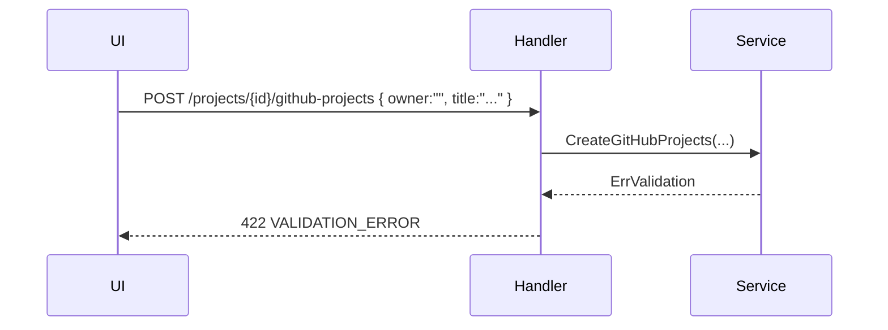
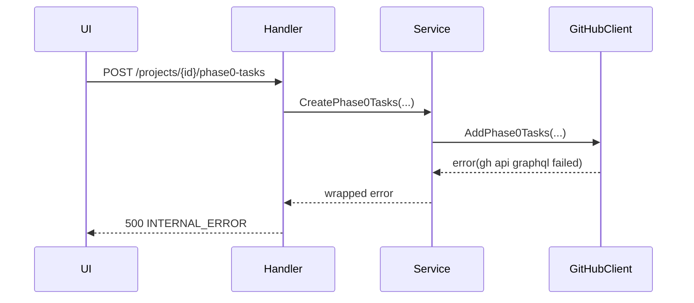

# 009.シーケンス図（エラー詳細）

前: [008.フロントエンドコンポーネント設計書](008.フロントエンドコンポーネント設計書.md) | [一覧](README.md) | 次: なし

## 1. owner 未入力（422）

```mermaid
sequenceDiagram
  participant UI
  participant Handler
  participant Service

  UI->>Handler: POST /projects/{id}/github-projects { owner:"", title:"..." }
  Handler->>Service: CreateGitHubProjects(...)
  Service-->>Handler: ErrValidation
  Handler-->>UI: 422 VALIDATION_ERROR
```

## 2. GraphQL 実行失敗（500）

```mermaid
sequenceDiagram
  participant UI
  participant Handler
  participant Service
  participant GH as GitHubClient

  UI->>Handler: POST /projects/{id}/phase0-tasks
  Handler->>Service: CreatePhase0Tasks(...)
  Service->>GH: AddPhase0Tasks(...)
  GH-->>Service: error(gh api graphql failed)
  Service-->>Handler: wrapped error
  Handler-->>UI: 500 INTERNAL_ERROR
```
