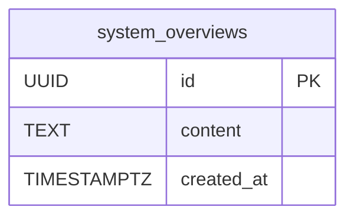

# Musuhi DB全体設計書

[上位](README.md)

目次（クリックで展開）

- [1. 目的](#1-目的)
- [2. テーブル一覧（全体）](#2-テーブル一覧全体)
- [3. 論理ER図（現行）](#3-論理er図現行)
- [4. 将来拡張（設計メモ）](#4-将来拡張設計メモ)
- [5. 参照ドキュメント](#5-参照ドキュメント)
- [6. 更新ルール](#6-更新ルール)

---

## 1. 目的

本書は Musuhi システム全体のデータモデルを俯瞰し、
テーブル一覧と ER 図を単一ドキュメントで管理するための全体設計書である。

---

## 2. テーブル一覧（全体）

現時点で設計確定・実装済みのテーブルは以下。

| テーブル名 | 役割 | 主キー | 主なカラム | 対応機能 | 詳細設計 |
| --- | --- | --- | --- | --- | --- |
| `system_overviews` | ユーザが入力したシステム概要テキストを保存 | `id (UUID)` | `content`, `created_at` | FR-001 | [FR-001 DB設計書](001.FR-001-システム概要入力/FR-001-DB設計書.md) |

---

## 3. 論理ER図（現行）

- 現行スコープでは単一テーブル構成。
- 外部キー制約は未定義。

---

## 4. 将来拡張（設計メモ）

FR-001 DB設計書に基づく将来拡張のメモ。

| 項目 | 内容 | 状態 |
| --- | --- | --- |
| `projects` 系テーブル | FR-002 以降で `system_overviews.id` を参照する拡張を想定 | 未設計 |
| 履歴管理カラム | `updated_at` / `deleted_at` など | 未採用（FR-001時点） |
| 追加インデックス | 利用クエリ増加時に検討 | 未採用（FR-001時点） |

---

## 5. 参照ドキュメント

- [FR-001 DB設計書](001.FR-001-システム概要入力/FR-001-DB設計書.md)
- [FR-001 API仕様書](001.FR-001-システム概要入力/FR-001-API仕様書.md)
- [FR-001 処理フロー設計書](001.FR-001-システム概要入力/FR-001-処理フロー設計書.md)

---

## 6. 更新ルール

- 新規テーブル追加時は本書の「テーブル一覧」と「ER図」を同一コミットで更新する。
- テーブル詳細は機能別 DB 設計書に追記し、本書は要約と参照リンクを維持する。
- 外部キー追加時は ER 図へリレーションを必ず反映する。