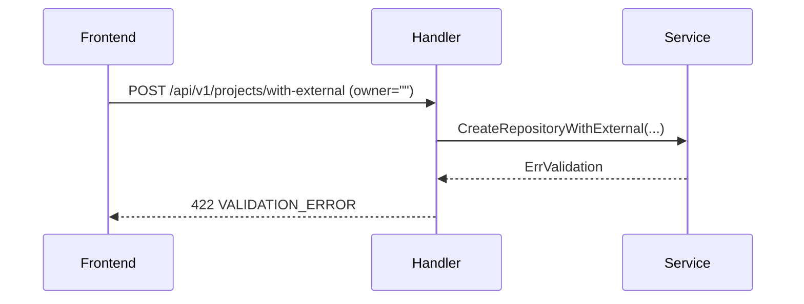
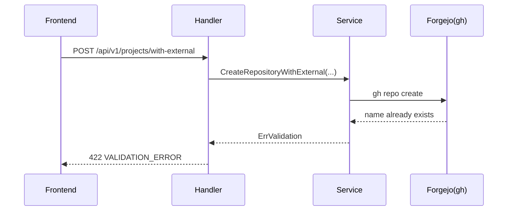
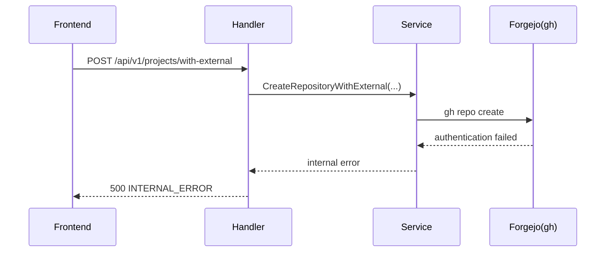
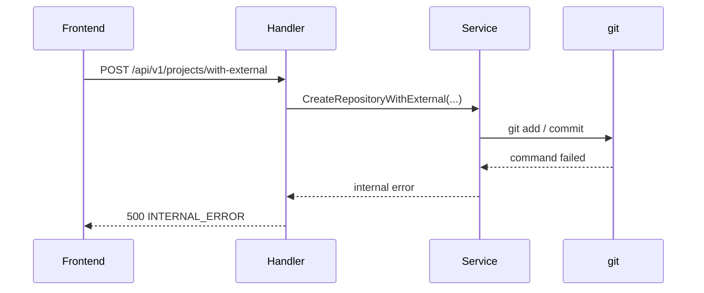

# FR-003-シーケンス図（エラー詳細）

前: [FR-003-フロントエンドコンポーネント設計書](FR-003-フロントエンドコンポーネント設計書.md) | [一覧](README.md)

## 1. エラー一覧

| # | エラー種別 | HTTP | code |
| --- | --- | --- | --- |
| E-01 | owner 空 | 422 | `VALIDATION_ERROR` |
| E-02 | repoName 重複 | 422 | `VALIDATION_ERROR` |
| E-03 | Forgejo 認証失敗 | 500 | `INTERNAL_ERROR` |
| E-04 | git 実行失敗 | 500 | `INTERNAL_ERROR` |

## 2. owner 空（422）

## 3. repoName 重複（422）

## 4. Forgejo 認証失敗（500）

## 5. git 実行失敗（500）

## 更新履歴

| 日付 | 版 | 変更内容 | 作成者 |
| --- | --- | --- | --- |
| 2026-05-09 | 0.1 | 初版作成 | Copilot |
