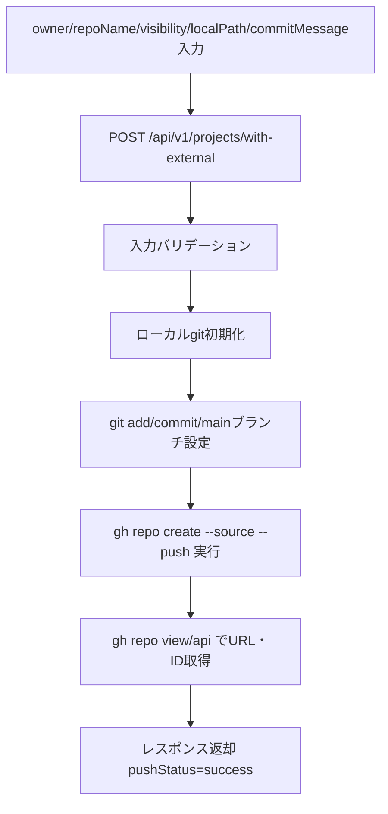

# FR-003-処理フロー設計書

前: [README](README.md) | [一覧](../README.md) | 次: [FR-003-インフラ構成図](FR-003-インフラ構成図.md)

## 1. 目的

FR-003（Forgejoリポジトリ作成・initial push）のバックエンド処理フローを定義する。

## 2. 正常系フロー

## 3. エラー処理

- `owner` が空: `VALIDATION_ERROR` (422)
- `repoName` が空または命名規則不適合: `VALIDATION_ERROR` (422)
- `visibility` が `public/private` 以外: `VALIDATION_ERROR` (422)
- `localPath` が空・絶対パスでない・ディレクトリ未存在: `VALIDATION_ERROR` (422)
- `commitMessage` が空または 256 文字超過: `VALIDATION_ERROR` (422)
- JSON 形式不正: `BAD_REQUEST` (400)
- Forgejo認証失敗・repo 作成失敗・git 実行失敗: `INTERNAL_ERROR` (500)

## 4. 実装反映先

- API: `services/musuhi-api/src/internal/handler/project.go`
- Service: `services/musuhi-api/src/internal/service/project.go`
- External連携: `services/musuhi-api/src/internal/service/project_external.go`
- Route: `services/musuhi-api/src/main.go`

## 更新履歴

| 日付 | 版 | 変更内容 | 作成者 |
| --- | --- | --- | --- |
| 2026-05-09 | 0.1 | 初版作成 | Copilot |
