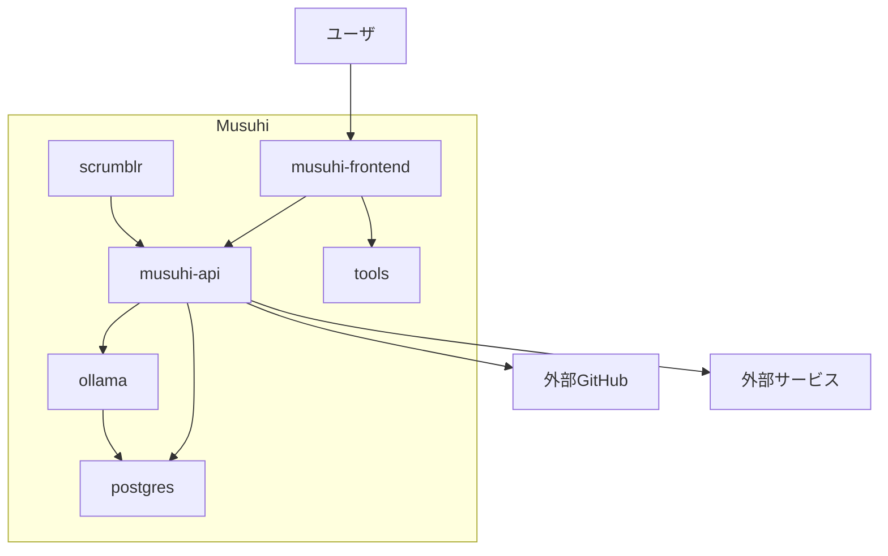

# システム構成図

本ドキュメントは Musuhi プロジェクトの現時点におけるシステム全体構成を示します。

## 1. 構成概要

Musuhiは以下の主要コンポーネントで構成されます：

- **musuhi-api**: バックエンドAPIサーバ
- **musuhi-frontend**: フロントエンドWebアプリケーション
- **scrumblr**: コラボレーション用サービス
- **ollama**: LLM推論エンジン（ローカルLLM APIサーバ）
- **postgres**: データベース（PostgreSQL）
- **tools**: 開発・運用支援ツール群
- **_compose**: Docker Composeによるローカル開発・統合環境
- **_document**: ドキュメント管理

## 2. システム構成図

## 3. 各コンポーネントの役割

- **musuhi-frontend**: ユーザインターフェースを提供し、APIと連携して各種操作を実現します。
- **musuhi-api**: 業務ロジック・データ管理・外部連携（GitHub等）を担います。
- **scrumblr**: 付箋型コラボレーションボードを提供します。
- **ollama**: LLM（大規模言語モデル）APIサーバ。musuhi-apiから推論リクエストを受け付け、ローカルでAI応答を生成します。
- **postgres**: Musuhi全体のデータを管理するリレーショナルデータベースです。
- **tools**: issue管理やドキュメント生成などの支援ツールを格納します。
- **_compose**: 各サービスのローカル統合・起動管理を行います。

## 4. ネットワーク・デプロイ構成

- ローカル開発はDocker Composeで全サービス（musuhi-api, musuhi-frontend, scrumblr, ollama, postgres等）を統合起動
- 本番環境は各サービスを個別にデプロイ（将来的にKubernetes等も想定）

---

> 本構成図は2026年5月時点の内容です。今後の開発進捗に応じて随時更新します。