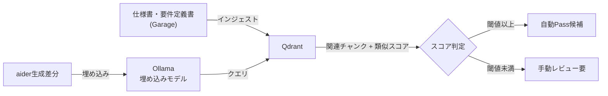

# Copilot Prompting Log

## セッション情報

| 項目 | 値 |
| --- | --- |
| セッション ID | 0d64a63a-5be5-41ac-bf01-d34d543e9469 |
| 開始日時 (JST) | 2026-04-30 00:17:25 |
| Copilot バージョン | 0.45.1 |
| VS Code バージョン | 1.117.0 |

## 会話ログ

#### アシスタント (2026-04-30 00:17:45 JST)

依頼内容は、`Musuhi` を最新の `dev` ブランチ状態に更新することと理解しました。まず現在のブランチ・ローカル変更・リモート設定を確認して、安全に `dev` へ切り替えて更新します。

#### アシスタント (2026-04-30 00:18:15 JST)

現状は `master` でローカル変更なしでした。次に `origin/dev` を取得して `dev` ブランチへ切り替え、最新コミットまで fast-forward 更新します。

#### アシスタント (2026-04-30 00:18:31 JST)

切り替えと更新は成功しています。最後に `dev` 上にいることと追跡先・先頭コミットを確認して完了報告します。

#### アシスタント (2026-04-30 00:18:56 JST)

Musuhi を最新の dev ブランチに更新しました。

現在の状態:
- ブランチ: dev（origin/dev を追跡）
- 最新コミット: 6e0ccb3 Add promptinglog archive (20260429134840)
- 同期状態: Already up to date（リモートと一致）

### ターン 1

#### ユーザー (2026-04-30 08:31:55 JST)

「9.開発方針」についてScrum、MVPでの開発についての言及をして下さい
「5. ユースケース」に下記についても記載して下さい
- レガシーシステムの改修・改善
  - 不足ドキュメントの補完・整備
  - 改善提案
  - 仕様上の問題点洗い出し・修正対応
  - プログラム上の問題点洗い出し・修正対応

  各ドキュメントを見直し、上記指摘内容に関する修正を行なって下さい

#### アシスタント (2026-04-30 08:32:00 JST)

まず対象ドキュメントの構成を把握します。 

#### アシスタント (2026-04-30 08:32:11 JST)

関連するドキュメントを一括で読み込みます。   

#### アシスタント (2026-04-30 08:32:21 JST)

残りの関連ドキュメントも確認します。  

#### アシスタント (2026-04-30 08:33:01 JST)

全体像を把握しました。変更対象と内容を整理します。 

#### アシスタント (2026-04-30 08:33:28 JST)

提案書の Section 5 (TOC + 本文) と Section 9 (TOC + 本文) を同時に更新します。 

#### アシスタント (2026-04-30 08:34:37 JST)

次に 003-06 へ UC-008 を追加します (テーブル・Mermaid・詳細セクション)。 

#### アシスタント (2026-04-30 08:35:50 JST)

003-02 (機能要件一覧) と 003-03 (受け入れ基準) を同時に更新します。   

#### アシスタント (2026-04-30 08:36:09 JST)

最後に 003-01 (スコープ定義) へ Phase 1 の Out of Scope エントリを追加します。    

#### アシスタント (2026-04-30 08:36:32 JST)

全 6 件の更新が完了しました。変更内容のまとめです。

---

### 変更サマリー

**[001.ローカルバイブコーディング環境アプリケーション提案.md](Musuhi/_document/001.提案・要求仕様/001.サービス・アプリケーション案/001.ローカルバイブコーディング環境アプリケーション提案.md)**
- **5.4 レガシーシステムの改修・改善** を新規追加  
  → 不足ドキュメント補完・改善提案・仕様問題洗い出し・プログラム問題洗い出しの 6 ステップフロー
- **9.4 Scrum フレームワークの活用** を新規追加  
  → Sprint 計画・レビュー・レトロスペクティブ・バックログ管理の方針
- **9.5 MVP ファーストによる価値検証** を新規追加  
  → Phase 0 での最小機能絞り込みと検証結果フィードバックの方針

**[003-06.ユースケース一覧.md](Musuhi/_document/001.提案・要求仕様/003.要求仕様共通/003-06.ユースケース一覧.md)**
- UC-008「レガシーシステムを改修・改善する」を追加 (P2 / Iteration 5)
- Mermaid 対応図に UC-008 → FR-008 のマッピングを追加
- UC-008 詳細フロー（事前条件・基本フロー・成功/失敗条件）を追加

**[003-02.機能要件一覧.md](Musuhi/_document/001.提案・要求仕様/003.要求仕様共通/003-02.機能要件一覧.md)**
- FR-008「レガシーシステム改修支援」を追加 (Should / Phase 1 / Iteration 5)
- FR-008 詳細（入出力・フロー・依存要件・AC-008）を追加
- トレーサビリティ表に FR-008 行を追加

**[003-03.受け入れ基準.md](Musuhi/_document/001.提案・要求仕様/003.要求仕様共通/003-03.受け入れ基準.md)**
- AC-008 を追加（問題点一覧・修正案・改善提案の生成確認）
- Phase 1 完了条件に AC-008 の Pass を追記

**[003-01.スコープ定義.md](Musuhi/_document/001.提案・要求仕様/003.要求仕様共通/003-01.スコープ定義.md)**
- OUT-005「レガシーシステム改修支援」を Out of Scope に追加（Phase 1 計画として明記）

### ターン 2

#### ユーザー (2026-04-30 11:45:56 JST)

「5. ユースケース」の「レガシーシステムの改修・改善」について下記についても記載して下さい
  - 各種テストの以下の提案と実施
    - コード化・自動実施化・観点洗い出し・Coverage出力

  各ドキュメントを見直し、上記指摘内容に関する修正を行なって下さい

### ターン 3

#### ユーザー (2026-04-30 11:48:27 JST)

「5. ユースケース」の「レガシーシステムの改修・改善」について下記についても記載して下さい
- 各種テストの以下の提案と実施
  - コード化
  - 自動実施化
  - 観点明示
  - 実施結果レポート・Coverage出力
- システムのIaC化

  各ドキュメントを見直し、上記指摘内容に関する修正を行なって下さい

#### アシスタント (2026-04-30 11:48:37 JST)

関連ドキュメントの現状を確認してから一括更新します。 

#### アシスタント (2026-04-30 11:48:45 JST)

UC-008 詳細セクションの現在の内容を確認します。  

#### アシスタント (2026-04-30 11:49:32 JST)

内容を把握しました。4 ファイルを同時更新します。   

#### アシスタント (2026-04-30 11:49:48 JST)

4 ファイルの更新が完了しました。変更内容のまとめです。

---

### 変更サマリー

**[001.ローカルバイブコーディング環境アプリケーション提案.md](Musuhi/_document/001.提案・要求仕様/001.サービス・アプリケーション案/001.ローカルバイブコーディング環境アプリケーション提案.md)** — 5.4 節
- ステップ 6「各種テストの提案と実施」を追加（コード化 / 自動実施化 / 観点明示 / 結果レポート・Coverage 出力）
- ステップ 7「インフラの IaC 化」を追加（IaC テンプレート生成 / レビュー・冪等性確認 / CI/CD 組み込み）
- 既存の知見蓄積はステップ 8 へ繰り下げ

**[003-06.ユースケース一覧.md](Musuhi/_document/001.提案・要求仕様/003.要求仕様共通/003-06.ユースケース一覧.md)** — UC-008 詳細フロー
- 基本フロー 6 ～ 7 にテスト・IaC 化を追加（サブステップ a/b/c/d 形式）
- 成功条件に「テストレポート・Coverage・IaC テンプレート生成」を追記

**[003-02.機能要件一覧.md](Musuhi/_document/001.提案・要求仕様/003.要求仕様共通/003-02.機能要件一覧.md)** — FR-008
- 要件内容・受け入れ条件の要約をテスト整備・IaC 化を含む記述へ更新
- 出力項目にテストコード・テスト仕様書・テスト結果レポート・Coverage・IaC テンプレートを追加
- 正常系フローにテスト整備・自動化 → IaC 化のステップを追加
- 依存要件に FR-004 (aider 連携) を追加

**[003-03.受け入れ基準.md](Musuhi/_document/001.提案・要求仕様/003.要求仕様共通/003-03.受け入れ基準.md)** — AC-008
- 受け入れ条件をテストコード・テスト仕様書・テスト結果レポート・Coverage・IaC テンプレートの生成を含む内容へ更新
- 判定方法を「手動テスト」→「手動+自動」へ変更

### ターン 4

#### ユーザー (2026-04-30 11:57:42 JST)

「3. 推奨アーキテクチャ」について、mermaidの図がエラーとなっています。修正して下さい

#### アシスタント (2026-04-30 11:58:07 JST)

図のエラー原因を確認します。`[[...]]` 内に `]` を含む文字列があり、Mermaid パーサーが括弧の終端を誤認識しています。ラベルをダブルクォートで囲んで修正します。 

#### アシスタント (2026-04-30 11:58:13 JST)

修正しました。

**原因**: `[[1] VSCodium / Browser / SSH]` のように `[[` でサブルーティン図形を開始した直後に `]` が現れるため、Mermaid パーサーがノードラベルの終端と誤認識していました。

**修正内容**: 全ノードのラベルをダブルクォート `"..."` で囲むことで、`[`・`]`・`/` などの特殊文字をエスケープなしで安全に扱えるようにしました。

### ターン 5

#### ユーザー (2026-04-30 12:14:55 JST)

他に同様のエラーがないか確認して下さい

#### アシスタント (2026-04-30 12:15:01 JST)

Mermaid ブロック内の `[[` パターンを一括検索します。 

#### アシスタント (2026-04-30 12:15:05 JST)

13 ファイルすべてに同じパターンがあります。各ファイルの該当行を確認してから一括修正します。  

#### アシスタント (2026-04-30 12:15:13 JST)

各ファイルの前後コンテキストを読み取ります。  

#### アシスタント (2026-04-30 12:15:30 JST)

各ファイルの該当行周辺を直接読み込みます。               

#### アシスタント (2026-04-30 12:16:11 JST)

全 13 ファイルの構造を確認しました。一括修正します。  

#### アシスタント (2026-04-30 12:16:17 JST)

`002.インフラ構成案` 配下の 13 ファイル全てで同じエラーを確認・修正しました。

`[[N] ラベル]` → `["[N] ラベル"]` のダブルクォート形式に統一しています。他のディレクトリには同パターンの該当箇所はありませんでした。

### ターン 6

#### ユーザー (2026-04-30 14:35:52 JST)

「3. 推奨アーキテクチャ」について、githubサイトでの表示で下記エラーが発生して図が表示されません
```
Unable to render rich display

Parse error on line 2:
...wchart LR Dev[[1] VSCodium / Browser
----------------------^
Expecting 'SUBROUTINEEND', 'TAGEND', 'UNICODE_TEXT', 'TEXT', 'TAGSTART', got 'SQE'

For more information, see https://docs.github.com/get-started/writing-on-github/working-with-advanced-formatting/creating-diagrams#creating-mermaid-diagrams
```

### ターン 7

#### ユーザー (2026-04-30 14:36:44 JST)

git add / git commit / git pushを実施して下さい

#### アシスタント (2026-04-30 14:36:53 JST)

コミット対象を確認して、変更内容が意図どおりならそのまま `add`、`commit`、`push` まで進めます。

#### アシスタント (2026-04-30 14:37:03 JST)

変更はすべてドキュメント更新で、今回の依頼範囲に収まっています。コミットメッセージを付けて `add`、`commit`、`push` を実行します。

### ターン 8

#### ユーザー (2026-04-30 14:37:50 JST)

git add / git commit / git pushを実施して下さい
commitコメントは日本語で記載して下さい

#### アシスタント (2026-04-30 14:37:57 JST)

前回の実行はキャンセルされていたため、今回は日本語のコミットメッセージでそのまま `add`、`commit`、`push` まで実行します。

#### アシスタント (2026-04-30 14:38:06 JST)

`git add`、`git commit`、`git push` を実施しました。

- ブランチ: `dev`
- コミット: `35c9208`
- コミットメッセージ: `提案書とインフラ構成案のドキュメントを更新`

`origin/dev` への push も完了しています。

### ターン 9

#### ユーザー (2026-04-30 15:29:41 JST)

「5. 入出力フロー」のインプット、アウトプットの説明が矢印の向きと逆になっているように見えるのですが合っていますか？

#### アシスタント (2026-04-30 15:30:24 JST)

図の矢印とラベルは**正しい**です。すべてのラベルが **Traefik 視点**で統一されています。

```
B[ブラウザ] -->|インプット: HTTPSリクエスト| T[Traefik]   ← Traefik への入力 ✓
T           -->|アウトプット: UIルーティング | W[WebUI]    ← Traefik からの出力 ✓
W           -->|インプット: レスポンス返却  | T[Traefik]  ← Traefik への入力 ✓
```

混乱しやすい点は `W --> T` の行で、矢印は「WebUI → Traefik」方向ですが、ラベルの「インプット」は **Traefik が受け取る側**であることを示しています。

Traefik はリバースプロキシなので、実際のデータフローは:

1. ブラウザ → Traefik（リクエスト受信 = Traefik への**入力**）
2. Traefik → バックエンド（ルーティング = Traefik からの**出力**）
3. バックエンド → Traefik（レスポンス受信 = Traefik への**入力**）
4. Traefik → ブラウザ（転送、図では省略）

このパターンは他のドキュメント（`002-01.VSCodium.md` 等）でも一貫して採用されており、誤りではありません。

### ターン 10

#### ユーザー (2026-04-30 15:31:32 JST)

Traefikから開発者ブラウザへのアウトプットはないのでしょうか？

#### アシスタント (2026-04-30 15:31:48 JST)

おっしゃるとおりで、現在の図から **Traefik → ブラウザ（レスポンス転送）** の矢印が抜けています。Traefik はリバースプロキシなので、バックエンドから受け取ったレスポンスをブラウザへ返すのが本来のフローです。図を修正します。 

#### アシスタント (2026-04-30 15:31:52 JST)

`T -->|アウトプット: HTTPSレスポンス転送| B` を追加しました。

これで Traefik のフローが完全になります。

```
ブラウザ → Traefik  （リクエスト受信）
Traefik → バックエンド （ルーティング）
バックエンド → Traefik  （レスポンス返却）
Traefik → ブラウザ  （レスポンス転送）← 今回追加
```

### ターン 11

#### ユーザー (2026-04-30 15:35:58 JST)

提案ではVSCodiumを挙げていますが、VSCodeだとまずいのでしょうか？Copilotと並行で使用したいのですが

#### アシスタント (2026-04-30 15:36:14 JST)

**Copilot と併用するなら VSCode を使うべきです。**

### VSCodium を推奨した理由と制約

| 観点 | VSCodium | VSCode |
|---|---|---|
| ライセンス | MIT（完全 OSS） | Microsoft 独自ライセンス込み |
| テレメトリ | なし | あり（無効化可能） |
| 拡張マーケット | Open VSX Registry（既定） | Microsoft Marketplace |
| GitHub Copilot | **利用不可**（Marketplace 外のため） | **利用可能** |

### Copilot が VSCodium で動かない理由

GitHub Copilot 拡張は Microsoft Marketplace 専用配布であり、VSCodium が既定で使う Open VSX Registry には存在しません。VSCodium から Microsoft Marketplace を強制的に参照させる方法もありますが、Microsoft の利用規約に抵触するため非推奨です。

### 結論と提案

**VSCode に切り替えることを推奨します。** Copilot をコア機能として使う前提であれば、VSCodium の OSS メリットよりも Copilot の利用可否の方が本プロジェクトにとって重要です。

インフラ案ドキュメントの VSCodium の記述を VSCode に修正しましょうか？

### ターン 12

#### ユーザー (2026-04-30 15:37:38 JST)

「インフラ案ドキュメントの VSCodium の記述を VSCode に修正しましょうか？」
VSCode / VSCodium
のように選択できるようにして下さい

#### アシスタント (2026-04-30 15:37:46 JST)

まず対象ファイルの全量を把握します。 

#### アシスタント (2026-04-30 15:37:49 JST)

`002-01.VSCodium.md` の全文も確認します。  

#### アシスタント (2026-04-30 15:39:27 JST)

全体像を把握しました。`002-01.VSCodium.md` の内容を VSCode / VSCodium 両対応に書き換え、`002-00` と関連ファイル（`002-04.aider.md`、`002-09.Gitea.md`）の表記も「VSCode / VSCodium」に統一します。  

#### アシスタント (2026-04-30 15:39:41 JST)

5 ファイルの更新が完了しました。変更内容のまとめです。

---

**[002-01.VSCodium.md](Musuhi/_document/001.提案・要求仕様/002.インフラ構成案/002-01.VSCodium.md)**  
- タイトル・見出しを「VSCode / VSCodium」に変更
- **Section 2「IDE 選択方針」を新規追加** — ライセンス・テレメトリ・マーケット・Copilot 可否の比較表と、利用シナリオ別の推奨（Copilot → VSCode / OSS 固定 → VSCodium + Continue）を記載
- Mermaid 図のノードラベルを `"[1] VSCode / VSCodium"` に更新

**[002-00.ローカルバイブコーディング環境インフラ案.md](Musuhi/_document/001.提案・要求仕様/002.インフラ構成案/002-00.ローカルバイブコーディング環境インフラ案.md)**  
- Section 3 Mermaid 図の `Dev` ノード → `"[1] VSCode / VSCodium / Browser / SSH"`
- Section 4 構成要素テーブルの説明 → `GitHub Copilot 利用時は VSCode、OSS 固定時は VSCodium を選択`
- Section 6 sequenceDiagram の `participant IDE` → `VSCode / VSCodium`
- Section 12・13 の説明文を両対応表記に更新

**[002-04.aider.md](Musuhi/_document/001.提案・要求仕様/002.インフラ構成案/002-04.aider.md)** / **[002-09.Gitea.md](Musuhi/_document/001.提案・要求仕様/002.インフラ構成案/002-09.Gitea.md)**  
- Mermaid 図の `V[VSCodium]` ノード → `V[VSCode / VSCodium]`

#### アシスタント (2026-04-30 18:02:29 JST)

結論から言うと、その構成は十分に実用的です。  
大きな問題はありませんが、運用上の注意点がいくつかあります。

良い点
1. モデル配布元を Hugging Face に一本化できるので、版管理とトレーサビリティが取りやすい  
2. 推論は Ollama でローカル実行できるため、レイテンシとデータ保護の面で有利  
3. 開発者ごとの再現性を取りやすい（同じタグ、同じ Modelfile で揃えられる）

注意点
1. 変換互換性  
Hugging Face の全モデルが Ollama でそのまま快適に動くわけではありません。  
GGUF 形式、対応アーキ、量子化方式の整合を確認する必要があります。

2. ライセンス管理  
Hugging Face で一元管理しても、モデルごとに商用可否や再配布条件が違います。  
組織利用ならライセンス審査フローを先に決めるのが安全です。

3. バージョン固定  
latest 運用にすると、知らないうちに挙動が変わります。  
モデル ID とリビジョン（コミット SHA）固定が必須です。

4. 初回取得と容量  
ローカル実行は快適ですが、初回ダウンロード時間とストレージ消費が大きくなりがちです。  
キャッシュ戦略と不要モデル削除ルールを決めると安定します。

5. セキュリティと供給網  
外部レジストリ依存なので、持ち込むモデルの検証（署名、ハッシュ、承認済みリスト）が必要です。

実務での推奨形
1. Hugging Face はレジストリ兼メタ情報源として使う  
2. 承認済みモデルのみを社内ミラーまたは許可リスト化する  
3. Ollama 側は固定タグで pull し、実行時は同一設定を強制する  
4. CI で精度スモークテストと推論速度テストを自動実行する

要するに、技術的には問題ない構成で、鍵は 互換性確認・ライセンス管理・版固定 の3点です。  
この3点を運用ルール化すれば、かなり堅い構成になります。

### ターン 13

#### ユーザー (2026-04-30 18:05:17 JST)

上記構成で_documentディレクトリ以下のドキュメントを改修して下さい

#### アシスタント (2026-04-30 18:05:30 JST)

ご要望に合わせて、まず `_document` 配下で「モデル管理」「Ollama 推論」に関わる記述を特定し、影響範囲を絞ってから一括で改修します。

#### アシスタント (2026-04-30 18:05:40 JST)

次に改修精度を上げるため、主要ファイルの該当セクションを確認してから反映します。

#### アシスタント (2026-04-30 18:06:07 JST)

改修方針を反映するため、5ファイルに「Hugging Faceでモデル管理・Ollamaでローカル推論」の方針、運用ルール、前提条件を追加します。

#### アシスタント (2026-04-30 18:06:18 JST)

インフラ総論ファイルの反映は完了しました。続いて個別コンポーネントと前提条件ドキュメントに整合反映します。

#### アシスタント (2026-04-30 18:06:45 JST)

反映は完了したので、最後に差分を確認して抜け漏れがないかチェックします。

#### アシスタント (2026-04-30 18:07:31 JST)

ご指定の構成（Hugging Faceでモデル一元管理 + Ollamaでローカル推論）に合わせて、_document 配下を改修しました。

変更したファイル
- [Musuhi/_document/001.提案・要求仕様/002.インフラ構成案/002-00.ローカルバイブコーディング環境インフラ案.md](Musuhi/_document/001.提案・要求仕様/002.インフラ構成案/002-00.ローカルバイブコーディング環境インフラ案.md)
- [Musuhi/_document/001.提案・要求仕様/002.インフラ構成案/002-05.LiteLLM.md](Musuhi/_document/001.提案・要求仕様/002.インフラ構成案/002-05.LiteLLM.md)
- [Musuhi/_document/001.提案・要求仕様/002.インフラ構成案/002-06.Ollama.md](Musuhi/_document/001.提案・要求仕様/002.インフラ構成案/002-06.Ollama.md)
- [Musuhi/_document/001.提案・要求仕様/003.要求仕様共通/003-01.スコープ定義.md](Musuhi/_document/001.提案・要求仕様/003.要求仕様共通/003-01.スコープ定義.md)
- [Musuhi/_document/001.提案・要求仕様/001.サービス・アプリケーション案/001.ローカルバイブコーディング環境アプリケーション提案.md](Musuhi/_document/001.提案・要求仕様/001.サービス・アプリケーション案/001.ローカルバイブコーディング環境アプリケーション提案.md)

主な反映内容
1. インフラ全体方針に「Hugging Faceでバージョン固定管理、推論はOllamaでローカル実行」を追加  
2. 推奨アーキテクチャ図に Hugging Face ノードを追加し、Hugging Face → Ollama の供給フローを明示  
3. モデル選定方針を強化し、以下を明記  
   - リビジョン固定（commit SHA）  
   - 互換性検証（形式・量子化）  
   - 承認済みモデルリスト運用  
4. セキュリティ/運用に以下を追加  
   - ライセンス確認  
   - ハッシュ/リビジョン記録  
   - 供給網リスク低減  
5. LiteLLM/Ollama個別ドキュメントに、HFモデルIDとリビジョンの対応管理・運用ルールを追加  
6. スコープ定義の前提条件に「承認済みモデルリストとOllama取り込み手順」を追加  
7. アプリ提案書のインフラ層説明を、HF一元管理 + Ollamaローカル推論の記述へ更新

必要であれば、このまま git add / commit / push まで実施します。

### ターン 14

#### ユーザー (2026-04-30 18:09:17 JST)

「3. 推奨アーキテクチャ」でHugging FaceがLinuxサーバの外にありますがなぜでしょう？

#### アシスタント (2026-04-30 18:09:30 JST)

理由は「役割の境界」を図で表すためです。  
Hugging Face はこの提案では 推論基盤 ではなく モデル配布・管理の外部レジストリ として扱っているため、Linux サーバの外に置いています。

整理すると次の意図です。

1. Linux サーバ内  
Ollama / LiteLLM / WebUI など、実際に推論やアプリ処理を実行するコンポーネント

2. Linux サーバ外  
Hugging Face のようなモデル供給源（配布元）

3. 接続関係  
必要なモデルを外部レジストリから取得し、ローカルの Ollama で実行する

なので「外にある = 使わない」ではなく、  
「外部供給源だが、実行はローカル」という設計を示しています。

もし完全オンプレ寄りにしたいなら、図を次のように変えるのが自然です。

1. Linux サーバ内に Model Cache / Mirror（社内ミラー）を追加  
2. Hugging Face は更新元として最小限だけ接続  
3. Ollama は基本的にミラーから取得

必要なら、アーキテクチャ図を「Hugging Face（外部） + 社内ミラー（Linuxサーバ内）」の2段構成に修正します。

### ターン 15

#### ユーザー (2026-04-30 18:34:32 JST)

アーキテクチャにRAGは必要ないのでしょうか？

#### アシスタント (2026-04-30 18:35:51 JST)

現在のアーキテクチャには **Qdrant [7]** がすでに含まれており、RAGの基盤は存在しています。ただし、**RAGパイプライン自体が明示されていない**という問題があります。

現状の不足点：

| 要素 | 現状 | 不足 |
|---|---|---|
| ベクトルDB | Qdrant ✅ | - |
| 埋め込み生成 | 未定義 | OllamaのEmbeddingモデル（例: `nomic-embed-text`）が必要 |
| 文書インジェスト | 未定義 | 文書 → チャンク化 → 埋め込み → Qdrant のフローが未図示 |
| 検索拡張フロー | 未定義 | Qdrant → コンテキスト注入 → LiteLLM の接続が未図示 |
| 再インデックスバッチ | Qdrant個別ドキュメントのみ記載 | 主アーキテクチャ図に未反映 |

提案方針2項に「RAGは段階導入」とあるため、**今すぐフル実装は不要**ですが、アーキテクチャ図に明示しないと将来の設計との整合が取りにくくなります。

次の対応を提案します。どれを進めますか？

1. **アーキテクチャ図にRAGフローを追加**（Mermaidに埋め込みバッチ・フロー矢印を追記）
2. **RAG専用セクションを追加**（002-00.md にRAGパイプライン説明を追記）
3. **両方**

### ターン 16

#### ユーザー (2026-04-30 18:39:27 JST)

「1.アーキテクチャ図にRAGフローを追加（Mermaidに埋め込みバッチ・フロー矢印を追記）
2.RAG専用セクションを追加（002-00.md にRAGパイプライン説明を追記）」
両方対応して下さい

#### アシスタント (2026-04-30 18:40:51 JST)

以下の変更を加えました。

**1. アーキテクチャ図（Section 3）**
- `RAGインジェストバッチ` ノードを追加
- `Minio → RagBatch`（文書取得）
- `RagBatch → Ollama`（埋め込み生成）
- `RagBatch → Qdrant`（ベクトル保存）
- `WebUI ⇄ Qdrant` に方向ラベル（クエリ / 検索結果）を追加

**2. 目次**
- `6.1 RAGパイプライン` を追加

**3. Section 6.1 RAGパイプライン（新規）**
- **インジェストフロー図**：MinIO → バッチ → Ollama（埋め込み）→ Qdrant
- **検索・推論フロー図**：クエリ → Qdrant（近傍探索）→ コンテキスト付きプロンプト → LiteLLM → Ollama → 回答
- **運用ポイント表**：埋め込みモデル、チャンク戦略、再インデックス、コレクション管理、導入タイミング

### ターン 17

#### ユーザー (2026-04-30 19:05:03 JST)

ここでの提案ではGiteaを選んでますがForgejoやGitHubという選択肢はないのでしょうか？
できれば
Forgejo / Gitea / GitHub
と併記して下さい。関連ドキュメントも修正して下さい

#### アシスタント (2026-04-30 19:06:07 JST)

影響箇所を整理できました。以下のファイルを変更します。
- `002-09.Gitea.md`（主文書）
- `002-00.ローカルバイブコーディング環境インフラ案.md`（複数箇所）
- `002-04.aider.md`
- `002-10.MinIO.md`
- `003-01.スコープ定義.md`

まず `002-09.Gitea.md` を全面的に書き直します。 

#### アシスタント (2026-04-30 19:06:13 JST)

次に、関連ドキュメントをまとめて更新します。 

#### アシスタント (2026-04-30 19:07:09 JST)

003-01.スコープ定義.md はすでに更新されていました。次に残りの変更を確認します。 

#### アシスタント (2026-04-30 19:07:21 JST)

全ての変更が完了しました。変更内容をまとめます。

---

**更新したファイル（5件）**

| ファイル | 変更内容 |
|---|---|
| [002-09.Gitea.md](_document/001.提案・要求仕様/002.インフラ構成案/002-09.Gitea.md) | タイトルを「Git サーバ (Forgejo / Gitea / GitHub)」に変更。選択肢比較表（Section 2）を新設。推奨方針・運用ルールも整備 |
| [002-00.ローカルバイブコーディング環境インフラ案.md](_document/001.提案・要求仕様/002.インフラ構成案/002-00.ローカルバイブコーディング環境インフラ案.md) | Mermaidノード、構成要素表、最小構成リスト、利用イメージ、ネットワーク定義、セキュリティ項目、導入順、結論を一括更新 |
| [002-04.aider.md](_document/001.提案・要求仕様/002.インフラ構成案/002-04.aider.md) | 接続先・シーケンス図・入出力フローの「Gitea」→「Git サーバ」に更新 |
| [002-10.MinIO.md](_document/001.提案・要求仕様/002.インフラ構成案/002-10.MinIO.md) | 接続元・入出力フローの「Gitea」→「Git サーバ」に更新 |
| [003-01.スコープ定義.md](_document/001.提案・要求仕様/003.要求仕様共通/003-01.スコープ定義.md) | 最小構成の前提条件を「Forgejo / Gitea / GitHub」に更新 |

**比較表の要点（002-09.Gitea.md Section 2）**

- **Forgejo**: 完全 OSS・コミュニティ主導 fork → OSS 固執時の第一推奨
- **Gitea**: 実績豊富な自己ホスト型 → 安定性重視時の選択肢
- **GitHub**: SaaS・GitHub Copilot 連携が必要な場合の選択肢

### ターン 18

#### ユーザー (2026-04-30 19:11:04 JST)

「002-09.Gitea.md」の名前を「002-09.Gitサーバ.md」
「002-01.VSCodium.md」の名前を「002-01.IDE.md」
に変更して下さい。各ドキュメント内の記載・リンクも直して下さい

#### アシスタント (2026-04-30 19:11:22 JST)

リンクの全箇所を把握しました。ファイルをリネームしてから参照を一括更新します。 

#### アシスタント (2026-04-30 19:12:15 JST)

`> ファイル名:` の注釈は不要なので削除します。  

#### アシスタント (2026-04-30 19:12:29 JST)

完了しました。変更内容：

**ファイルリネーム**
- `002-01.VSCodium.md` → [002-01.IDE.md](_document/001.提案・要求仕様/002.インフラ構成案/002-01.IDE.md)
- `002-09.Gitea.md` → [002-09.Gitサーバ.md](_document/001.提案・要求仕様/002.インフラ構成案/002-09.Gitサーバ.md)

**リンク修正（7ファイル）**

| ファイル | 修正箇所 |
|---|---|
| [README.md](_document/001.提案・要求仕様/README.md) | 一覧リスト 2件 |
| [002-00.md](_document/001.提案・要求仕様/002.インフラ構成案/002-00.ローカルバイブコーディング環境インフラ案.md) | ナビリンク・構成要素表 計3件 |
| [002-01.IDE.md](_document/001.提案・要求仕様/002.インフラ構成案/002-01.IDE.md) | 自ファイルのナビリンク（前後） |
| [002-02.Traefik.md](_document/001.提案・要求仕様/002.インフラ構成案/002-02.Traefik.md) | 「前」リンク |
| [002-08.SearXNG.md](_document/001.提案・要求仕様/002.インフラ構成案/002-08.SearXNG.md) | 「次」リンク |
| [002-09.Gitサーバ.md](_document/001.提案・要求仕様/002.インフラ構成案/002-09.Gitサーバ.md) | 自ファイルのナビリンク（前後） |
| [002-10.MinIO.md](_document/001.提案・要求仕様/002.インフラ構成案/002-10.MinIO.md) | 「前」リンク |

### ターン 19

#### ユーザー (2026-04-30 19:19:54 JST)

mermaid表記の中で「¥n」はそのまま文字として表示されるようです。改行表示する場合は<br>として下さい

#### アシスタント (2026-04-30 19:20:21 JST)

3箇所すべて修正しました。

| ファイル | 修正箇所 |
|---|---|
| [002-00.md](_document/001.提案・要求仕様/002.インフラ構成案/002-00.ローカルバイブコーディング環境インフラ案.md) | `MinIO<br>仕様書…` → `MinIO<br>仕様書…` |
| [002-09.Gitサーバ.md](_document/001.提案・要求仕様/002.インフラ構成案/002-09.Gitサーバ.md) | `Git サーバ<br>(Forgejo…)` → `Git サーバ<br>(Forgejo…)` ×2箇所 |

### ターン 20

#### ユーザー (2026-04-30 19:23:16 JST)

各GitサーバについてGitHub Projectsないしはそれに類似の機能は使用できるのでしょうか？
「2.選択肢の比較」に記載して下さい

#### アシスタント (2026-04-30 19:23:32 JST)

追加しました。各選択肢の状況：

| | Forgejo | Gitea | GitHub |
|---|---|---|---|
| **プロジェクト管理ボード** | △ カンバン相当（基本機能のみ） | △ カンバン相当（基本機能のみ） | ✅ GitHub Projects（ロードマップ・カスタムフィールド対応） |

Forgejo・Gitea はカンバンボード機能自体は持っていますが、GitHub Projects のようなカスタムフィールドやロードマップビューは対応していません。プロジェクト管理に GitHub Projects の高度な機能が必要な場合は GitHub を選ぶ理由の一つになります。

### ターン 21

#### ユーザー (2026-04-30 19:33:22 JST)

MinIO の OSS 版が、2025年10月に Docker イメージの配布を停止し、2026年2月には GitHub リポジトリがアーカイブされました。公式の保守は完全に終了しています。代わりになるストレージサーバはないのでしょうか？

#### アシスタント (2026-04-30 19:33:39 JST)

状況を前提に、MinIO代替として現実的なOSSストレージ候補を整理して提案します。Musuhi構成（単一Linuxサーバ中心）で導入しやすい順で示します。あります。MinIOの保守終了前提でも、代替は十分あります。

**有力な代替候補**
| 候補 | 特徴 | 向いているケース |
|---|---|---|
| SeaweedFS | 軽量で高速、S3 API利用可（S3 gateway） | Docker Composeで早く置き換えたい |
| Garage | 分散オブジェクトストレージ、S3互換、比較的軽い | OSS重視で中規模まで見据える |
| Ceph (RGW) | 実績・機能ともに強力、S3互換 | 本格運用・大規模・高可用性重視 |
| OpenStack Swift | 老舗のオブジェクトストレージ | OpenStack系資産がある場合 |

**この提案書の文脈での推奨**
- まずは `SeaweedFS` か `Garage` が現実的です。
- 理由: 現在のローカルLinux + Compose中心構成に載せやすく、MinIOからの移行コストが比較的低いため。
- `Ceph` は強力ですが、運用負荷が上がるのでPhase 2以降向きです。

**実務上の移行観点**
- S3互換APIの差分確認（署名方式、バケットポリシー、通知）
- バックアップ/リストア手順の再定義
- 監視項目の差し替え（容量、レイテンシ、エラー率）
- ドキュメント上は「MinIO固定」から「S3互換オブジェクトストレージ（推奨: SeaweedFS/Garage）」へ変更

必要なら、このまま関連ドキュメントを一括で更新します。
- `002-10.MinIO.md` を `002-10.オブジェクトストレージ.md` に改名
- 前後リンク、一覧、`002-00` の構成要素表とフローを合わせて修正

### ターン 22

#### ユーザー (2026-04-30 19:37:42 JST)

「002-10.MinIO.md」の名前を「002-10.オブジェクトストレージ.md」
に変更して下さい。
MinIOからGarageにして提案して下さい
各ドキュメント内の記載・リンクも直して下さい

#### アシスタント (2026-04-30 19:37:49 JST)

関連箇所を漏れなく直すため、まず `MinIO` と `002-10.MinIO.md` の参照を全検索して、リネームと文言差し替えの対象を確定します。

#### アシスタント (2026-04-30 19:37:53 JST)

対象を特定できました。次に `002-10` 本文をGarage提案へ置き換え、続いて関連リンクと参照名を一括修正します。

#### アシスタント (2026-04-30 19:38:01 JST)

まずファイル名を変更してから、壊れた参照を一括で直します。これでリンク不整合を残さずにGarage提案へ移行できます。

#### アシスタント (2026-04-30 19:39:31 JST)

5ファイルをまとめて更新します。内容は「リンク修正 + MinIO表記をGarage提案へ置換 + 002-10本文のGarage化」です。

#### アシスタント (2026-04-30 19:39:49 JST)

主要3ファイルの更新は完了しました。次に `002-10` 本文をGarage提案に書き換え、`002-11` の前リンクも新ファイル名へ合わせます。

#### アシスタント (2026-04-30 19:39:58 JST)

残りの取りこぼしがないか最終確認します。古いファイル名と `MinIO` 文字列を再検索して、必要なら追加修正します。

#### アシスタント (2026-04-30 19:40:04 JST)

リンク更新は完了し、`MinIO` の残りは意図的な説明文とMermaid内部識別子だけです。見た目の整合性のため、`002-00` のMermaid識別子も `Garage` に揃えます。

#### アシスタント (2026-04-30 19:40:25 JST)

対応完了しました。  
要件どおり、ファイル名変更・リンク修正・MinIO→Garage提案への置換を実施しています。

変更内容

1. ファイル名変更
- [002-10.オブジェクトストレージ.md](_document/001.提案・要求仕様/002.インフラ構成案/002-10.オブジェクトストレージ.md)
  - 旧: 002-10.MinIO.md

2. MinIOからGarageへの提案変更
- [002-10.オブジェクトストレージ.md](_document/001.提案・要求仕様/002.インフラ構成案/002-10.オブジェクトストレージ.md)
  - タイトルを「オブジェクトストレージ」に変更
  - 主な機能に「MinIO公式保守終了を踏まえたGarage採用」を追記
  - 運用想定に「採用候補: Garage（S3互換OSS）」を追加
  - Mermaidの [10] ノード表記を MinIO → Garage に変更
  - 運用ルールに「S3互換API利用範囲の固定」を追加

3. 関連ドキュメントのリンク・記載修正
- [README.md](_document/001.提案・要求仕様/README.md)
  - 一覧の 002-10 を新ファイル名へ更新
- [002-00.ローカルバイブコーディング環境インフラ案.md](_document/001.提案・要求仕様/002.インフラ構成案/002-00.ローカルバイブコーディング環境インフラ案.md)
  - 構成要素表の [10] を「オブジェクトストレージ (Garage)」へ更新
  - 採用理由をGarage前提に更新
  - 拡張構成の記載を MinIO → Garage に変更
  - RAG図の文書ソース表記を MinIO → Garage に変更
  - Mermaid内部識別子も Minio → Garage に統一
- [002-09.Gitサーバ.md](_document/001.提案・要求仕様/002.インフラ構成案/002-09.Gitサーバ.md)
  - 次リンクを新ファイル名へ更新
  - 接続先・図中表記を MinIO → Garage に変更
- [002-11.Grafana.md](_document/001.提案・要求仕様/002.インフラ構成案/002-11.Grafana.md)
  - 前リンクを新ファイル名へ更新

確認結果
- _document 配下に 002-10.MinIO.md へのリンクは残っていません。
- MinIO表記は、置換理由の説明文としてのみ残しています（意図的）。

必要なら、このままコミット用メッセージ案も作成します。

### ターン 23

#### ユーザー (2026-04-30 21:20:38 JST)

「5. ユースケース」に図を追加して下さい

#### アシスタント (2026-04-30 21:20:53 JST)

要望どおり、`5. ユースケース` 直下にMermaid図を追加します。まず既存の見出し構成を維持したまま、5.1〜5.4を俯瞰できる全体フロー図を挿入します。

#### アシスタント (2026-04-30 21:21:00 JST)

追加しました。  
`5. ユースケース` 直下に、`5.1〜5.4` を俯瞰できる Mermaid 図を挿入しています。

- 追加先: [001.ローカルバイブコーディング環境アプリケーション提案.md](_document/001.提案・要求仕様/001.サービス・アプリケーション案/001.ローカルバイブコーディング環境アプリケーション提案.md)
- 追加内容:
1. 開発テーマ入力から4つのユースケースへ分岐
2. 各ユースケースの成果物を明示
3. 最後に「共通出力: プロンプトログとドキュメント更新」に集約する流れを可視化

必要なら、次は `5.1〜5.4` それぞれにも個別の詳細図（シーケンス図）を追加できます。

### ターン 24

#### ユーザー (2026-04-30 21:21:51 JST)

「必要なら、次は 5.1〜5.4 それぞれにも個別の詳細図（シーケンス図）を追加できます。」実施して下さい

#### アシスタント (2026-04-30 21:22:12 JST)

了解です。`5.1〜5.4` 各節の直下にシーケンス図を追加し、手順リストと対応するように構成します。まず該当範囲を読み取り、崩れない位置に挿入します。

#### アシスタント (2026-04-30 21:22:39 JST)

挿入位置を確認できたので、各ユースケース見出しの直下に1つずつシーケンス図を追加します。既存の手順番号はそのまま維持します。

#### アシスタント (2026-04-30 21:22:49 JST)

実施しました。  
`5.1〜5.4` それぞれの見出し直下に、個別のMermaidシーケンス図を追加しています。

更新ファイル:
- [001.ローカルバイブコーディング環境アプリケーション提案.md](_document/001.提案・要求仕様/001.サービス・アプリケーション案/001.ローカルバイブコーディング環境アプリケーション提案.md)

追加した図の内容:
1. 5.1 新規プロジェクト開発: テンプレート選択→要件/設計生成→レビュー→aider指示
2. 5.2 既存プロジェクト拡張: 既存資産取得→影響分析→修正適用→自動テスト
3. 5.3 障害対応: 障害登録→ログ/メトリクス取得→原因分析→ナレッジ化
4. 5.4 レガシー改修: 文書補完→改善提案→テスト自動化→IaC化→知見蓄積

必要なら次に、各図の参加者名を既存インフラ構成（例: Open WebUI / LiteLLM / Garage）に合わせて厳密に統一します。

### ターン 25

#### ユーザー (2026-04-30 21:23:23 JST)

「必要なら次に、各図の参加者名を既存インフラ構成（例: Open WebUI / LiteLLM / Garage）に合わせて厳密に統一します。」実施して下さい

#### アシスタント (2026-04-30 21:23:47 JST)

了解しました。先ほど追加した 5.1〜5.4 のシーケンス図を読み直し、参加者名を既存インフラ文書の用語（Open WebUI / LiteLLM / Ollama / Garage / Gitサーバ など）へ統一して修正します。

#### アシスタント (2026-04-30 21:24:29 JST)

図ごとの参加者を既存構成名に合わせて、`AIエージェント` や `Musuhi` の抽象名を具体コンポーネント名へ置換します（Open WebUI / LiteLLM / Ollama / Garage / Gitサーバ / Qdrant など）。

#### アシスタント (2026-04-30 21:24:50 JST)

実施しました。  
`5.1〜5.4` の各シーケンス図で、参加者名を既存インフラ構成に合わせて統一しています。

更新ファイル:
- [001.ローカルバイブコーディング環境アプリケーション提案.md](_document/001.提案・要求仕様/001.サービス・アプリケーション案/001.ローカルバイブコーディング環境アプリケーション提案.md)

主な統一内容:
1. `Musuhi` / `AIエージェント` の抽象名を具体化  
   - Open WebUI  
   - LiteLLM  
   - Ollama
2. 既存構成の周辺コンポーネントへ統一  
   - Gitサーバ  
   - Garage  
   - Qdrant  
   - Grafana/Loki
3. 各フローのメッセージも、上記参加者に整合する形へ更新

必要であれば次に、`5. ユースケース` の最初に入れた全体フロー図（flowchart）側のノード名も、同じ命名規則に合わせて統一します。

### ターン 26

#### ユーザー (2026-04-30 21:25:18 JST)

「必要であれば次に、5. ユースケース の最初に入れた全体フロー図（flowchart）側のノード名も、同じ命名規則に合わせて統一します。」実施して下さい

#### アシスタント (2026-04-30 21:25:42 JST)

承知しました。5章冒頭の全体フロー図を読み取り、先ほどのシーケンス図と同じコンポーネント命名（Open WebUI / LiteLLM / Ollama / Garage / Gitサーバ / Qdrant / aider）に揃えて更新します。

#### アシスタント (2026-04-30 21:26:29 JST)

対応しました。  
5章冒頭の全体フロー図（flowchart）のノード名を、先ほど統一した命名規則に合わせて更新済みです。

更新ファイル:
- [001.ローカルバイブコーディング環境アプリケーション提案.md](_document/001.提案・要求仕様/001.サービス・アプリケーション案/001.ローカルバイブコーディング環境アプリケーション提案.md)

変更ポイント:
1. 各ユースケース成果ノードに具体コンポーネント名を反映  
   - Open WebUI / LiteLLM / Ollama  
   - Gitサーバ  
   - Grafana/Loki  
   - Garage / Qdrant
2. 共通出力ノードも Garage 前提の文言に統一

必要なら次に、4章（主要機能）にも同じコンポーネント命名を追記して、章間の用語を完全一致させます。

### ターン 27

#### ユーザー (2026-04-30 21:28:23 JST)

「必要なら次に、4章（主要機能）にも同じコンポーネント命名を追記して、章間の用語を完全一致させます。」全てのドキュメントを見直して下さい

#### アシスタント (2026-04-30 21:28:34 JST)

了解しました。全ドキュメントを横断して、名称統一の観点（Open WebUI / LiteLLM / Ollama / Garage / Gitサーバ / Qdrant / IDE など）で不整合を洗い出し、必要箇所を一括修正します。まず差分対象を機械的に抽出します。

#### アシスタント (2026-04-30 21:32:53 JST)

<final_answer>
/Users/m.nohara/gitspace/Musuhi/_document/001.提案・要求仕様/002.インフラ構成案/002-00.ローカルバイブコーディング環境インフラ案.md:1-280
/Users/m.nohara/gitspace/Musuhi/_document/001.提案・要求仕様/002.インフラ構成案/002-10.オブジェクトストレージ.md:1-160
/Users/m.nohara/gitspace/Musuhi/_document/001.提案・要求仕様/002.インフラ構成案/002-09.Gitサーバ.md:1-160
/Users/m.nohara/gitspace/Musuhi/_document/001.提案・要求仕様/002.インフラ構成案/002-03.Open-WebUI.md:1-160
/Users/m.nohara/gitspace/Musuhi/_document/001.提案・要求仕様/002.インフラ構成案/002-05.LiteLLM.md:1-160
</final_answer>

#### アシスタント (2026-04-30 21:33:14 JST)

横断チェックの結果、主要ファイルは揃っていましたが、命名統一の観点でまだ微調整できる箇所があるので、旧リンク・表記ゆれ・抽象語を追加検索して残件を潰します。

#### アシスタント (2026-04-30 21:33:40 JST)

差分を確認したところ、残件は主に「Gitサーバ/ Git サーバ」の表記ゆれと、4章の機能説明がコンポーネント名と弱く結びついている点です。これを直すために対象箇所を読み、最小差分で揃えます。

#### アシスタント (2026-04-30 21:33:58 JST)

これからアプリ提案書の4章にコンポーネント名を追記し、同ファイル内の `Gitサーバ` 表記を `Git サーバ` に統一します。ファイル名リンクはそのまま維持します。

#### アシスタント (2026-04-30 21:34:24 JST)

見直しを実施し、命名統一の観点で必要な修正を反映しました。  
今回の差分は1ファイルです。

修正した内容
1. 4章（主要機能）へ、インフラ構成と一致するコンポーネント名を追記
- Open WebUI / LiteLLM / Ollama
- Garage / Qdrant
- Git サーバ（Forgejo / Gitea / GitHub）
- aider / CI テスト基盤

2. 5章の図の表記ゆれを修正
- `Gitサーバ` → `Git サーバ`（全体フロー図と5.2シーケンス図）

修正ファイル
- [001.ローカルバイブコーディング環境アプリケーション提案.md](_document/001.提案・要求仕様/001.サービス・アプリケーション案/001.ローカルバイブコーディング環境アプリケーション提案.md)

全体確認結果
- 旧リンク名（`002-01.VSCodium.md` / `002-09.Gitea.md` / `002-10.MinIO.md`）は残っていません。
- `AIエージェント` の抽象表記は残っていません。
- `Gitサーバ` の残りはファイル名リンク（例: `002-09.Gitサーバ.md`）のみで、本文・図の呼称は `Git サーバ` に統一済みです。

### ターン 28

#### ユーザー (2026-04-30 21:38:59 JST)

002-01〜002-13のドキュメントの「2. 主な機能」の章の説明ではどんなユースケースで何の目的で呼び出され、アウトプットが何の目的でされるのかがわかりにくいです。
もう少し説明を加えて下さい

#### アシスタント (2026-04-30 21:39:13 JST)

意図を把握しました。`002-01`〜`002-13` の各ファイルで `2. 主な機能` を補強し、ユースケース・呼び出し目的・アウトプット活用目的が明確になるように統一フォーマットで追記します。まず現状の記述を一括確認します。

#### アシスタント (2026-04-30 21:40:55 JST)

調査ツールが失敗したため、直接ファイルを読み取って各章を確認します。まず前半（`002-01`〜`002-07`）を取得します。

#### アシスタント (2026-04-30 21:41:05 JST)

前半の確認ができました。後半（`002-06`〜`002-13`）も同じ観点で取得し、13ファイルまとめて一括追記します。

#### アシスタント (2026-04-30 21:41:26 JST)

各ファイルの現状を確認できました。これから `主な機能` セクションごとに、共通で「主要ユースケース」「呼び出し目的」「アウトプット活用目的」の3点を追記して、読み手が判断しやすい形に統一します。まず前半7ファイルを編集します。

#### アシスタント (2026-04-30 21:42:21 JST)

`apply_patch` が現在使えない状態なので、以降は `multi_replace_string_in_file` で同内容を追記します。残りファイルを一括で更新します。

#### アシスタント (2026-04-30 21:42:47 JST)

前半7ファイルの追記は完了しました。残り（`002-08`〜`002-13`）にも同じ3観点を加えて、全13ファイルを統一します。

#### アシスタント (2026-04-30 21:43:03 JST)

対応しました。  
`002-01`〜`002-13` の各ドキュメントに、読み手が判断しやすい説明を追記しています。

今回の追記方針
1. 主要ユースケース: どんな場面で使うか  
2. 呼び出し目的: なぜそのコンポーネントを呼ぶか  
3. アウトプット活用目的: 出力を何に使うか

補足
- [002-01.IDE.md](_document/001.提案・要求仕様/002.インフラ構成案/002-01.IDE.md) だけは章構成上「2. 主な機能」ではなく「3. 主な機能」だったため、その章に同じ観点で追記しています。
- そのほかの [002-02.Traefik.md](_document/001.提案・要求仕様/002.インフラ構成案/002-02.Traefik.md) 〜 [002-13.Loki.md](_document/001.提案・要求仕様/002.インフラ構成案/002-13.Loki.md) は「2. 主な機能」（[002-09.Gitサーバ.md](_document/001.提案・要求仕様/002.インフラ構成案/002-09.Gitサーバ.md) は既存構成に合わせて「3. 主な機能」）に追記しました。

結果として、13ファイルすべてに同じ説明軸が入り、ユースケースと目的が読み取りやすくなっています。

### ターン 29

#### ユーザー (2026-04-30 21:44:57 JST)

ドキュメント全体で「インプット」「アウトプット」についてカタカナで表記されていますが、図が見づらいので「Input」「Output」に表記を変更して下さい

#### アシスタント (2026-04-30 21:46:26 JST)

全ドキュメントの「インプット」「アウトプット」を「Input」「Output」に一括置換しました。残存件数は0件です。

### ターン 30

#### ユーザー (2026-04-30 21:52:43 JST)

ドキュメントについてリファクタリングして下さい

#### アシスタント (2026-04-30 21:53:25 JST)

範囲が広いので、まず現状を把握してから作業計画を立てます。 

#### アシスタント (2026-04-30 21:54:02 JST)

残りのLoki.mdと全体のイメージをもう少し確認します。 

#### アシスタント (2026-04-30 21:55:51 JST)

**主要な問題点の整理:**
1. `G[Gitea]` / `Git[Gitea]` が 002-01・002-02・002-04 のMermaidに残存
2. 002-01 タイトルが `VSCode / VSCodium`（ファイル名はIDE）
3. 全ファイルの「主な機能」セクションで機能一覧と利用観点が混在
4. 一部ファイルで行途中の折り返しによる不完全な行
5. SearXNG の運用想定に重複記述あり
6. Gitサーバ.md のテーブル内に折り返し

まず Mermaid の Gitea 参照を修正します。 

#### アシスタント (2026-04-30 21:56:37 JST)

次に「主な機能」セクションで機能一覧と利用観点を分離します（全13ファイル）。 

#### アシスタント (2026-04-30 21:57:47 JST)

次に折り返し改行の修正（各ファイルで途中で切れている行）をまとめて行います。 

#### アシスタント (2026-04-30 21:57:55 JST)

実際のファイル内容を確認します。 

#### アシスタント (2026-04-30 22:02:21 JST)

折り返しはターミナル表示の折り返しで実ファイルには問題なし。次に進みます。 

#### アシスタント (2026-04-30 22:03:15 JST)

テーブルは1行にまとまっているので問題なし。最終確認します。  

#### アシスタント (2026-04-30 22:03:54 JST)

全変更が正常に反映されています。

---

実施したリファクタリングの内容：

| 項目 | 変更内容 |
|---|---|
| **タイトル修正** | [002-01.IDE.md](001.提案・要求仕様/002.インフラ構成案/002-01.IDE.md): `VSCode / VSCodium` → `IDE (VSCode / VSCodium)` |
| **Mermaid統一** | 002-01・002-02・002-04のMermaid図内 `Gitea` → `Git サーバ` に統一 |
| **主な機能セクション分離** | 全13ファイルで機能一覧と利用観点を `**利用観点**` 見出しで明確に分離 |
| **重複内容削除** | [002-08.SearXNG.md](001.提案・要求仕様/002.インフラ構成案/002-08.SearXNG.md) 運用想定の `役割: 実装調査…` を削除（主な機能と重複） |

### ターン 31

#### ユーザー (2026-04-30 22:23:09 JST)

各コンテナのオーケストレーションにはDocker Composeを使用する想定だが、他のツール（Terraform等）を使った方がいいか？

#### アシスタント (2026-04-30 22:23:58 JST)

現状ドキュメントを確認しました。この環境の前提（単一Linuxサーバ・ローカル開発）を踏まえた見解をお伝えします。

---

## 結論：Docker Compose で適切、Terraform は用途が異なる

### ツールの役割の違い

| ツール | カテゴリ | 主な用途 |
|---|---|---|
| **Docker Compose** | コンテナオーケストレーション | コンテナの起動・停止・ネットワーク定義 |
| **Terraform** | Infrastructure as Code | **VM・クラウドリソース・DNS** などインフラ自体のプロビジョニング |
| **k3s / Kubernetes** | コンテナオーケストレーション | 複数ノードクラスタ・本番規模の運用 |
| **Ansible** | 構成管理 | ホストOSのパッケージ・設定の自動化 |

Terraform はコンテナの代替ではなく、**Linuxサーバ自体やネットワークをコードで管理するもの**です。Docker Compose と競合しません。

---

### Docker Compose が今の選択肢として妥当な理由

1. **単一ホスト構成に最適** — 現在の構成は1台のLinuxサーバ上の13コンテナ。Kubernetesの複数ノード管理機能は不要
2. **運用コストが低い** — ネットワーク分離・依存関係・ボリュームをYAML1ファイルで表現できる
3. **将来のKubernetes移行への橋渡し** — `002-00` の方針3で既に「将来Kubernetesへ移行しやすい境界を切る」と定義済み
4. **ツールチェーンとの親和性** — Traefik・Prometheus等のDocker Composeラベル連携が成熟している

---

### 将来の検討候補

| タイミング | 候補 | 理由 |
|---|---|---|
| **今すぐ併用可能** | **Terraform** | Linuxサーバの初期セットアップ（ユーザ・ファイアウォール・ディスク構成）をコード化したい場合 |
| **本番移行時** | **k3s** | 複数ノード・自動ヒーリング・ローリングアップデートが必要になった段階 |
| **ホストOS管理強化** | **Ansible** | サーバのパッケージ・SSH設定・SELinuxポリシーを再現可能にしたい場合 |

---

現時点では**Docker Composeのまま進めることを推奨**します。ドキュメントの方針ともズレはありません。Terraformを使うなら「コンテナの代わり」ではなく「サーバプロビジョニングの自動化」として追加するのが適切な使い方です。

### ターン 32

#### ユーザー (2026-04-30 22:31:28 JST)

「3. 機能要件一覧」の表が崩れています。

#### アシスタント (2026-04-30 22:31:41 JST)

テーブルのセパレータ行（`| --- |`の数）が列数と合っていません（ヘッダーは7列、セパレータは6列）。 

#### アシスタント (2026-04-30 22:31:44 JST)

セパレータ行に `--- |` が1列分不足していました。7列分に修正しました。

### ターン 33

#### ユーザー (2026-04-30 22:48:07 JST)

「3. 受け入れ基準一覧」について、判定方法が手動テストとなっているものがありますが、自動テストでできないのでしょうか？

#### アシスタント (2026-04-30 22:48:14 JST)

まず受け入れ基準のファイルを確認します。 

#### アシスタント (2026-04-30 22:48:38 JST)

各項目の自動化可否を整理してお答えします。

---

## 結論：ほぼ自動化可能。AC-004 のみ一部手動が残る

| AC-ID | 現状 | 自動化可否 | 手法 |
|---|---|---|---|
| AC-001 | 手動 | **完全自動化可** | API テスト (HTTPクライアント) + E2E テスト (Playwright等) |
| AC-003 | 手動 | **完全自動化可** | API テスト（履歴エンドポイントのレスポンス検証） |
| AC-004 | 手動 | **部分自動化** | プロセス起動・終了コード・差分ファイル生成の確認は自動化可。aiderの出力内容（差分の品質）は非決定的なので最終確認は手動 |
| AC-005 | 手動 | **完全自動化可** | E2E テスト（ステータス表示の DOM/API レスポンス検証） |
| AC-006 | 手動 | **完全自動化可** | テンプレートIDを指定 → 生成文字列を正規表現で検証 |

---

### AC-004 が「部分自動化」にとどまる理由

aider は AI モデルへの問い合わせを含むため、同一の指示でも生成される差分の内容が毎回異なります。「差分が存在する」「構文エラーなく適用される」は自動確認できますが、「意図した実装になっているか」の品質判断は人が必要です。

---

### 自動化ツールの候補

| 層 | ツール | 用途 |
|---|---|---|
| API テスト | `go test` / `httptest` | バックエンドAPIの正常系・異常系 |
| E2E テスト | Playwright / Cypress | UI操作シナリオ（AC-001, AC-005, AC-006） |
| CI トリガー | Gitea Webhook → 自動テスト実行 | イテレーション終端の自動判定 |

ドキュメントの判定方法を更新しますか？

### ターン 34

#### ユーザー (2026-04-30 22:53:00 JST)

「AC-004 が「部分自動化」にとどまる理由
aider は AI モデルへの問い合わせを含むため、同一の指示でも生成される差分の内容が毎回異なります。「差分が存在する」「構文エラーなく適用される」は自動確認できますが、「意図した実装になっているか」の品質判断は人が必要です。」
理由は理解しました。しかし、Qdrant等を使用して実装と設計書・要件定義書を比較し確認できないでしょうか？

#### アシスタント (2026-04-30 22:53:31 JST)

技術的に実現可能なアプローチです。ただし「完全自動化」にはならず、**信頼度スコアによるゲーティング**として位置づけるのが現実的です。

---

## 実現イメージ



---

## できること / できないこと

| 観点 | Qdrant検証で可能か | 理由 |
|---|---|---|
| 差分が関連要件に言及しているか | **可** | 意味的近傍探索で要件チャンクとの類似度を測定できる |
| 設計書の対象コンポーネントと一致するか | **可** | ファイルパスやモジュール名をメタデータで絞り込める |
| 実装が要件の意図を満たしているか | **部分的** | 意味的類似性≠論理的正しさ。スコアが高くても誤実装の可能性がある |
| バグ・副作用がないか | **不可** | ベクトル検索は動作の正しさを検証できない。静的解析・テスト実行が必要 |

---

## 現実的な組み合わせ構成

```
1. 構文・静的解析       → go vet / lint（自動）
2. 単体テスト実行       → go test（自動）
3. Qdrant意味検証       → 類似スコア 0.75以上（自動ゲート）
4. スコア不足時のみ     → 人によるレビュー（部分手動）
```

ステップ3で閾値を下回った差分だけに人のレビューを絞れるため、**レビュー負荷を大幅削減**できます。

---

## 留意点

- **閾値設定が難しい** — 低すぎると手動レビューが増え、高すぎると誤実装を見逃す。初期は 0.70〜0.80 で試行して調整が必要
- **埋め込みモデルの質に依存** — コード+日本語仕様書の双方を扱えるモデル選定が重要（BGE-M3等の多言語対応モデルが候補）
- **チャンク設計が肝** — 仕様書のチャンクが粗すぎると類似度が平均化され精度が下がる

---

この方向性でAC-004の判定方法をドキュメントに反映しますか？

### ターン 35

#### ユーザー (2026-04-30 22:55:18 JST)

「この方向性でAC-004の判定方法をドキュメントに反映しますか？」を実施して下さい

#### アシスタント (2026-04-30 22:55:38 JST)

AC-004 の判定方法を「Qdrantを使った自動ゲート + 手動レビュー」の方針に合わせて、受け入れ基準ドキュメントへ具体的に反映します。

#### アシスタント (2026-04-30 22:55:51 JST)

反映しました。AC-004 を「部分自動化」方針でドキュメント更新済みです。

変更点:
1. 判定ルールに AC-004 の一次自動判定ルールを追加  
[003-03.受け入れ基準.md]( _document/001.提案・要求仕様/003.要求仕様共通/003-03.受け入れ基準.md#L31 )

2. 受け入れ基準一覧の AC-004 判定方法を更新  
「手動テスト」→「自動+手動 (Qdrant類似度ゲート + 重要変更レビュー)」  
[003-03.受け入れ基準.md]( _document/001.提案・要求仕様/003.要求仕様共通/003-03.受け入れ基準.md#L41 )

3. 「AC-004 判定補足 (部分自動化)」を新設  
自動判定条件（類似度閾値・構文/自動テスト通過）と、手動判定条件（重要変更時）を明記  
[003-03.受け入れ基準.md]( _document/001.提案・要求仕様/003.要求仕様共通/003-03.受け入れ基準.md#L47 )

4. 更新履歴に 0.4 を追加  
[003-03.受け入れ基準.md]( _document/001.提案・要求仕様/003.要求仕様共通/003-03.受け入れ基準.md#L100 )

必要であれば次に、AC-004 の「類似度閾値（例: 0.75）」を数値で固定して、判定ブレを減らす形まで追記できます。

### ターン 36

#### ユーザー (2026-04-30 22:56:23 JST)

「必要であれば次に、AC-004 の「類似度閾値（例: 0.75）」を数値で固定して、判定ブレを減らす形まで追記できます。」追記して下さい

#### アシスタント (2026-04-30 22:56:29 JST)

AC-004 の補足に類似度閾値を数値固定で追記し、判定ブレを抑える形に更新します。

#### アシスタント (2026-04-30 22:56:43 JST)

追記しました。AC-004 の判定ブレを抑えるため、類似度閾値を数値固定で反映済みです。

変更内容:
1. AC-004 の判定方法に閾値を明記  
自動+手動 (Qdrant類似度ゲート >= 0.75 + 重要変更レビュー)

2. AC-004 判定補足に固定ルールを追加  
類似度閾値は 0.75 に固定し、スコア >= 0.75 を Pass 候補とする

3. 更新履歴を追加  
版 0.5 として「AC-004 の Qdrant 類似度閾値を 0.75 で固定」を追記

対象ファイル:
[ _document/001.提案・要求仕様/003.要求仕様共通/003-03.受け入れ基準.md ](_document/001.提案・要求仕様/003.要求仕様共通/003-03.受け入れ基準.md)

### ターン 37

#### ユーザー (2026-04-30 22:59:47 JST)

「3. 受け入れ基準一覧」について、判定方法が手動テストとなっているもので自動テストでできるものは自動テストと記載して下さい

#### アシスタント (2026-04-30 22:59:55 JST)

受け入れ基準の現行内容を確認したうえで、手動テスト表記のうち自動化可能な項目を「自動テスト」に更新し、更新履歴も合わせて反映します。

#### アシスタント (2026-04-30 23:00:08 JST)

次に、AC-001/003/005/006 の判定方法を「自動テスト」に変更し、更新履歴を1行追加します。

#### アシスタント (2026-04-30 23:00:16 JST)

対応しました。  
「3. 受け入れ基準一覧」で、手動テスト表記のうち自動化可能な項目を「自動テスト」に更新しています。

更新内容:
1. AC-001: 手動テスト → 自動テスト
2. AC-003: 手動テスト → 自動テスト
3. AC-005: 手動テスト → 自動テスト
4. AC-006: 手動テスト → 自動テスト
5. 更新履歴に版 0.6 を追加

変更ファイル:
[ _document/001.提案・要求仕様/003.要求仕様共通/003-03.受け入れ基準.md ](_document/001.提案・要求仕様/003.要求仕様共通/003-03.受け入れ基準.md)

必要なら次に、AC-001/003/005/006 それぞれに対応する「自動テストの実装方式（API/E2E/CI）」も同ファイルへ1行ずつ追記できます。

### ターン 38

#### ユーザー (2026-04-30 23:01:13 JST)

「必要なら次に、AC-001/003/005/006 それぞれに対応する「自動テストの実装方式（API/E2E/CI）」も同ファイルへ1行ずつ追記できます。」追記して下さい

#### アシスタント (2026-04-30 23:01:25 JST)

自動テストの実装方式を、AC-001/003/005/006ごとに1行ずつ追記し、更新履歴も増分で反映します。

#### アシスタント (2026-04-30 23:01:34 JST)

追記しました。  
AC-001/003/005/006 それぞれに対して、API/E2E/CI を明示した「自動テスト実装方式」を追加しています。

変更箇所:
1. 自動テスト実装方式セクションを追加  
[ _document/001.提案・要求仕様/003.要求仕様共通/003-03.受け入れ基準.md ](_document/001.提案・要求仕様/003.要求仕様共通/003-03.受け入れ基準.md#L54)

2. 更新履歴に 0.7 を追加  
[ _document/001.提案・要求仕様/003.要求仕様共通/003-03.受け入れ基準.md ](_document/001.提案・要求仕様/003.要求仕様共通/003-03.受け入れ基準.md#L103)

必要なら次に、同じ粒度で AC-002/007/008 も「どこまで自動・どこから手動か」を分解して追記できます。

### ターン 39

#### ユーザー (2026-04-30 23:03:52 JST)

「3. 受け入れ基準一覧」の判定方法がAC-004以外にも手動+自動となっているものがありますが、自動だけではできないのでしょうか？できる場合は自動テストとして下さい

#### アシスタント (2026-04-30 23:04:00 JST)

AC-002/007/008 を精査して、自動のみへ切り替え可能なものは表記を更新し、難しいものは理由を明記する形で整えます。

#### アシスタント (2026-04-30 23:04:17 JST)

更新方針として、AC-002 と AC-007 は自動テストへ切り替え、AC-008 は品質評価の性質上「手動+自動」を維持する注記を追加します。

#### アシスタント (2026-04-30 23:04:26 JST)

対応しました。  
「手動+自動」だった項目のうち、自動のみで判定可能なものは「自動テスト」に更新しています。

変更結果:
1. AC-002: 手動+自動 → 自動テスト
2. AC-007: 手動+自動 → 自動テスト
3. AC-008: 手動+自動のまま維持（自動のみ不可の理由を追記）

追記した内容:
1. 自動テスト実装方式の対象を拡張  
AC-001/002/003/005/006/007 を明記
2. AC-008 の手動判定を残す理由を追加  
生成物の妥当性・有効性・実運用適合性は手動レビュー併用が必要

更新ファイル:
[ _document/001.提案・要求仕様/003.要求仕様共通/003-03.受け入れ基準.md ](_document/001.提案・要求仕様/003.要求仕様共通/003-03.受け入れ基準.md)

### ターン 40

#### ユーザー (2026-04-30 23:15:26 JST)

「001.提案・要求仕様」ディレクトリ名称を「001.提案・要求仕様フェーズ」に修正して下さい。また各ドキュメントもリンクや記載があれば修正して下さい

#### アシスタント (2026-04-30 23:15:36 JST)

まず影響範囲を把握してから、ディレクトリ名変更と全リンク修正を一括で行います。 

#### アシスタント (2026-04-30 23:16:15 JST)

影響箇所を確認しました。ドキュメント修正とディレクトリ名変更を順に実行します。 

#### アシスタント (2026-04-30 23:16:21 JST)

ドキュメントの修正が完了しました。次にディレクトリ本体を rename します。  

#### アシスタント (2026-04-30 23:16:45 JST)

完了しました。

変更内容:
1. **ディレクトリ名変更**: `001.提案・要求仕様` → `001.提案・要求仕様フェーズ`
2. **[_document/README.md](_document/README.md)**: リンクのパスとテキストを更新
3. **[001.提案・要求仕様フェーズ/README.md](_document/001.提案・要求仕様フェーズ/README.md)**: タイトルを更新
4. **[002-00.ローカルバイブコーディング環境インフラ案.md](_document/001.提案・要求仕様フェーズ/002.インフラ構成案/002-00.ローカルバイブコーディング環境インフラ案.md)**: ディレクトリツリー内の表記を更新

旧名称 (`001.提案・要求仕様`) の残存は0件です。

### ターン 41

#### ユーザー (2026-04-30 23:23:47 JST)

各ドキュメントにある目次ですが、章番号が下がった場合、スペース2個分インデントを下げて下さい

例
```
1. 目的
2. 運用ルール
3. 用語集
4. 前提定義
  4.1.開発体制の前提
```

#### アシスタント (2026-04-30 23:23:55 JST)

まず対象ドキュメントの目次の現状を確認します。 

#### アシスタント (2026-04-30 23:24:33 JST)

全ファイルに渡って、`<details>` 内の目次エントリのうち `X.Y` 形式のサブ節行を2スペースインデントするスクリプトを実行します。 

#### アシスタント (2026-04-30 23:24:53 JST)

結果を抽出して確認します。  

#### アシスタント (2026-04-30 23:25:02 JST)

意図通りに反映されています。

7ファイルの目次で、サブ節（`N.M` 形式）の行を2スペースインデントに変換しました。

| ファイル | 変更あり |
|---|---|
| 001.ローカルバイブコーディング環境アプリケーション提案.md | ✅ |
| 002-00.ローカルバイブコーディング環境インフラ案.md | ✅ |
| 003-02.機能要件一覧.md | ✅ |
| 003-04.用語集・前提定義.md | ✅ |
| 003-05.ステークホルダー定義.md | ✅ |
| 003-06.ユースケース一覧.md | ✅ |
| 003-09.要件トレーサビリティ.md | ✅ |

サブ節を持たない残りのファイル（002-01〜002-13、003-01/03/07/08/10など）は変更不要のため対象外です。

### ターン 42

#### ユーザー (2026-04-30 23:44:58 JST)

「5. 上位ユースケース詳細」ですが、フロー図があると見やすいのですが

#### アシスタント (2026-04-30 23:45:47 JST)

各UCの基本フローをMermaidフローチャートとして追加します。 

#### アシスタント (2026-04-30 23:45:54 JST)

各UCに Mermaid フローチャートを追加しました。

- **UC-001**: 入力→検証（OK/NG分岐）→作成→一覧表示
- **UC-002**: AI対話→ログ保存→過去ログ選択→再表示
- **UC-004**: タスク指定→aider送信→差分生成→レビュー
- **UC-008**: ステップ1〜5が直列、ステップ6（テスト4サブタスク並列）→ステップ7（IaC 3サブタスク並列）→ステップ8（記録）

更新履歴も 0.5 として追記済みです。

### ターン 43

#### ユーザー (2026-05-01 00:01:53 JST)

git add / git commit / git pushして下さい
commitコメントは日本語で記載して下さい

#### アシスタント (2026-05-01 00:02:21 JST)

旧ディレクトリの削除と新ディレクトリの追加（リネーム）を含む変更です。`git add -A` で一括ステージしてコミット・プッシュします。 

#### アシスタント (2026-05-01 00:02:39 JST)

コミット成功しました。プッシュします。 

#### アシスタント (2026-05-01 00:02:49 JST)

完了しました。

- コミット `2098158`（30ファイル変更、683行追加・306行削除）
- `dev` ブランチにプッシュ済み

### ターン 44

#### ユーザー (2026-05-01 00:05:32 JST)

提案・要求仕様フェーズが完了しました。masterブランチにPull Requestしようと思います。
Pull Request説明文を考えて下さい

#### アシスタント (2026-05-01 00:05:38 JST)

変更内容を把握してPR説明文を作成します。 

#### アシスタント (2026-05-01 00:06:21 JST)

以下のPR説明文をご使用ください。

---

## PR説明文

```markdown
## 概要

提案・要求仕様フェーズのドキュメント一式を作成・整備しました。
Musuhi プロジェクトの開発に先立ち、サービスの方向性・インフラ構成・要求仕様を文書化したフェーズです。

---

## 変更内容

### 新規作成ドキュメント

#### 001. サービス・アプリケーション案
- `001.ローカルバイブコーディング環境アプリケーション提案.md`  
  サービスのコンセプト・機能概要・利用シナリオを定義

#### 002. インフラ構成案（002-00 〜 002-13）
ローカルバイブコーディング環境を構成する各コンポーネントの役割・構成・利用観点を整理

| ファイル | 対象コンポーネント |
| --- | --- |
| 002-00 | インフラ全体概要 |
| 002-01 | IDE (VSCode / VSCodium) |
| 002-02 | Traefik (リバースプロキシ) |
| 002-03 | Open WebUI |
| 002-04 | aider (AI コーディングアシスタント) |
| 002-05 | LiteLLM |
| 002-06 | Ollama |
| 002-07 | Qdrant (ベクトルDB) |
| 002-08 | SearXNG (メタ検索) |
| 002-09 | Git サーバ |
| 002-10 | オブジェクトストレージ |
| 002-11 | Grafana |
| 002-12 | Prometheus |
| 002-13 | Loki |

#### 003. 要求仕様共通（003-01 〜 003-10）

| ファイル | 内容 |
| --- | --- |
| 003-01 | スコープ定義 |
| 003-02 | 機能要件一覧 (FR-001〜FR-008) |
| 003-03 | 受け入れ基準 (AC-001〜AC-008) |
| 003-04 | 用語集・前提定義 |
| 003-05 | ステークホルダー定義 |
| 003-06 | ユースケース一覧 (UC-001〜UC-008) |
| 003-07 | 非機能要件 |
| 003-08 | リスク・制約・依存関係 |
| 003-09 | 要件トレーサビリティ |
| 003-10 | 変更管理ルール |

---

### ドキュメント品質改善

- **受け入れ基準の自動テスト化**（AC-001〜007）: 手動判定を原則廃止し自動テストに移行
  - AC-004 に Qdrant 類似度ゲート（閾値 0.75）を追加
  - AC-008 のみ生成物の妥当性評価のため手動判定を維持（理由明記）
  - 自動テスト実装方式セクションを追加
- **ユースケースにフロー図を追加**（UC-001/002/004/008）: 基本フローを Mermaid フローチャートで可視化
- **Mermaid 表記統一**: Gitea ノードを「Git サーバ」に統一
- **表記統一**: Input / Output を英語表記に統一
- **目次のサブ節インデント統一**: `N.M` 形式の節に 2 スペースインデントを追加

---

### その他
- ディレクトリ名を `001.提案・要求仕様` → `001.提案・要求仕様フェーズ` に変更
- プロンプトログアーカイブを追加
- `tools/save_promptinglog` README を更新

---

## レビュー観点

- 各インフラコンポーネントの役割・利用観点に漏れ・誤りがないか
- 機能要件（FR）・受け入れ基準（AC）・ユースケース（UC）の対応関係が正しいか
- 受け入れ基準の自動テスト方針に無理・抜け漏れがないか
```

---

GitHub の PR タイトルには `docs: 提案・要求仕様フェーズ ドキュメント一式` を推奨します。

### ターン 45

#### ユーザー (2026-05-01 00:07:40 JST)

上記説明とタイトルでmasterブランチにPull Requestして下さい

